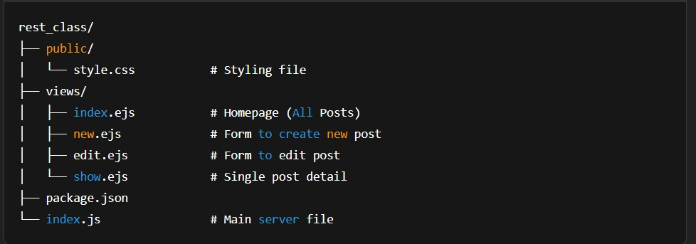

# Quora Posts Clone

A simple CRUD blog application inspired by Quora. Built with **Node.js**, **Express.js**, and **EJS**.

---

## 🚀 Features

- ✅ View all posts
- ➕ Create a new post
- ✏️ Edit an existing post
- ❌ Delete a post
- 👀 View post details
- 📄 Clean UI with basic CSS

---

## 🛠️ Tech Stack

- **Backend:** Node.js, Express.js
- **Templating:** EJS
- **Styling:** CSS
- **ID Generation:** UUID
- **Middleware:** Method-Override

---

## 📂 Project Structure




---

## ⚙️ Getting Started

1. **Clone the repository:**
   ```bash
   git clone https://github.com/vivekkumarguml/Quora-Posts-Clone.git
   cd Quora-Posts-Clone
2.**Install dependencies:**

npm install

3.**Run the application:**

node index.js

4.**Open in browser:**

http://localhost:8080/posts

**📦 Dependencies**
- [express](https://www.npmjs.com/package/express)

- [ejs](https://www.npmjs.com/package/ejs)

- [uuid](https://www.npmjs.com/package/uuid)

- [method-override](https://www.npmjs.com/package/method-override)


**📸 Screenshot**


**👨‍💻 Author**

Vivek Kumar


